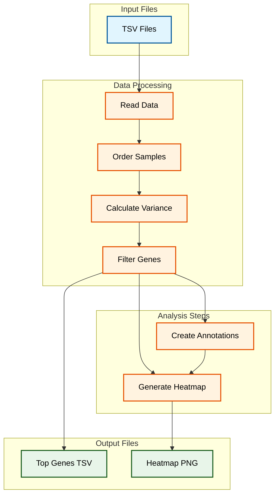

# README

README for Acute Myeloid Leukemia (AML) RNA-seq Analysis Pipeline

## Overview

This R-based pipeline performs RNA-seq analysis on Acute Myeloid Leukemia (AML) samples using hierarchical clustering and visualization techniques. The analysis focuses on identifying patterns in gene expression across different AML mutations and treatments.

## Dataset Description

- Source: SRP070849 experiment from Shih et al., 2017 0:1
- Contains 19 AML model mouse samples
``` Add more detail
- Includes RNA sequencing data with quantile normalization
- Features different mutation types (IDH2, TET2, WT) and treatments

## Analysis Pipeline

The pipeline consists of several interconnected steps that process the RNA-seq data from raw files to final visualization. Here's the workflow:




The workflow diagram above illustrates the pipeline's progression from input files through processing stages to final outputs. Blue boxes represent input data, orange boxes show processing steps, and green boxes indicate output files. Arrows demonstrate the sequential nature of operations, with parallel processes clearly visible in the analysis stage.

## Requirements

- R programming environment
- Required packages:
  - `pheatmap` for clustering and visualization
  - `magrittr` for data manipulation
  - `readr` for data import
  - `dplyr` for data transformation
  - `tibble` for data structures


## Directory Structure

```text
project_root/
├── data/
│   └── SRP070849/
│       ├── SRP070849.tsv     # Expression data
│       └── metadata_SRP070849.tsv  # Sample metadata
├── plots/
│   └── aml_heatmap.png       # Generated heatmap
└── results/
    └── top_90_var_genes.tsv  # High-variance genes
```

## Key Features

1. **Data Processing**  - Automated folder creation and organization
  - Quantile-normalized RNA-seq data handling
  - Sample order synchronization with metadata


2. **Gene Selection**  - Variance-based filtering of genes
  - Upper quartile selection criterion
  - Export of filtered gene lists


3. **Visualization**  - Hierarchical clustering of both samples and genes
  - Color-coded annotations for mutations and treatments
  - Custom color scheme (deepskyblue → black → yellow)
  - Row-wise scaling for expression values


## Usage Instructions

Clone the repository and ensure all required packages are installedPlace the SRP070849 dataset files in the `data/SRP070849/` directoryRun the RMarkdown notebook sequentiallyGenerated files will appear in their respective directories## Customization Options

- Gene selection criteria can be modified (currently uses variance-based filtering)
- Color scheme can be adjusted in the heatmap generation section
- Clustering parameters can be customized
- Output file formats can be changed (PNG → JPEG/TIFF)

## Troubleshooting

1. **Package Installation Issues**  - Run `install.packages("package_name")` for missing dependencies
  - Verify package installation with `installed.packages()`


2. **File Path Errors**  - Ensure dataset files match expected naming convention
  - Check directory structure matches documentation


3. **Memory Constraints**  - Consider reducing number of genes selected
  - Close unnecessary R sessions


## Acknowledgments

This analysis was adapted from the refine.bio-examples notebook and modified for this repository by Candace Savonen. The original dataset is sourced from Shih et al., 2017, available through refine.bio.
